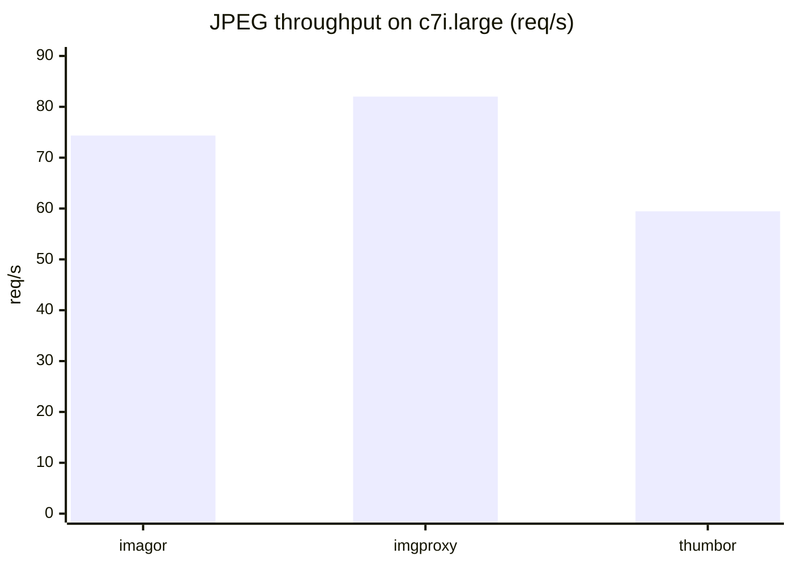
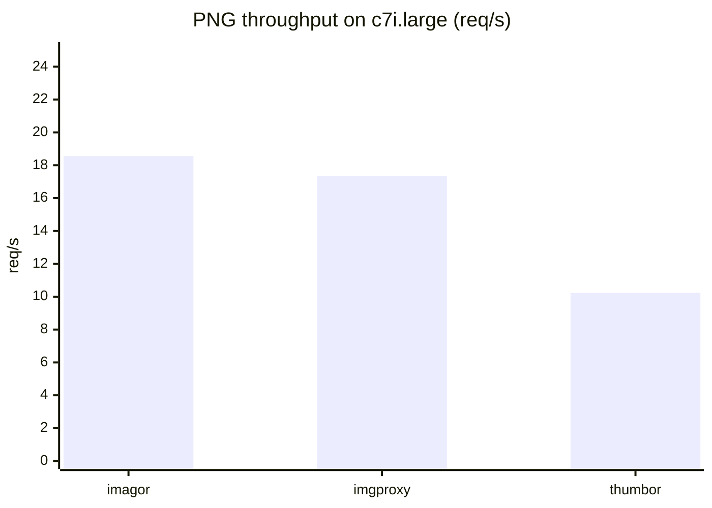
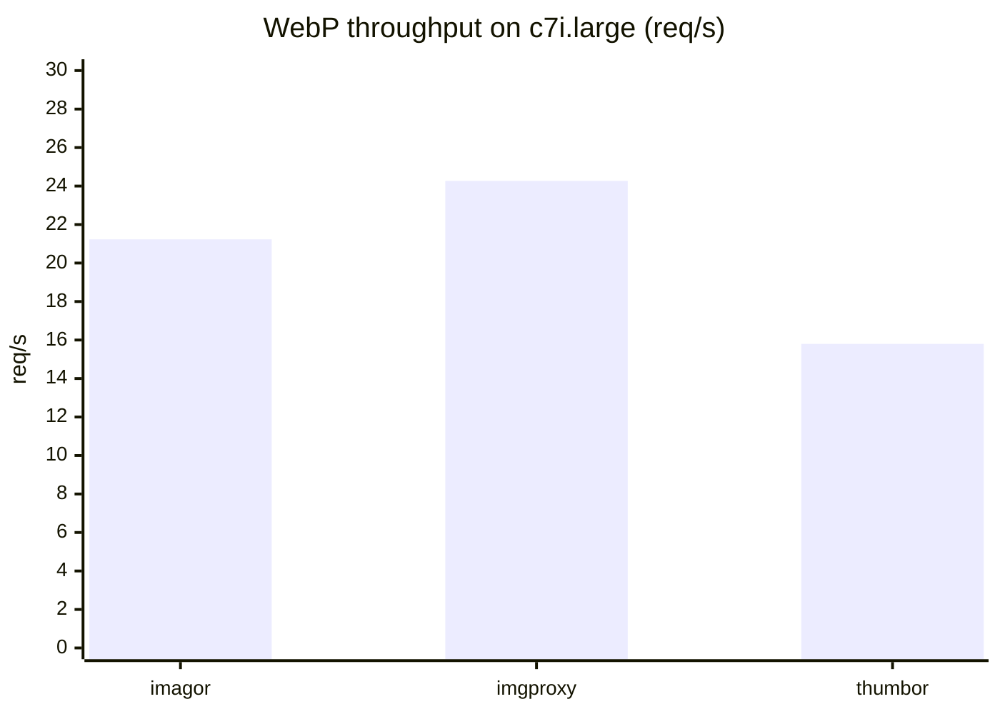
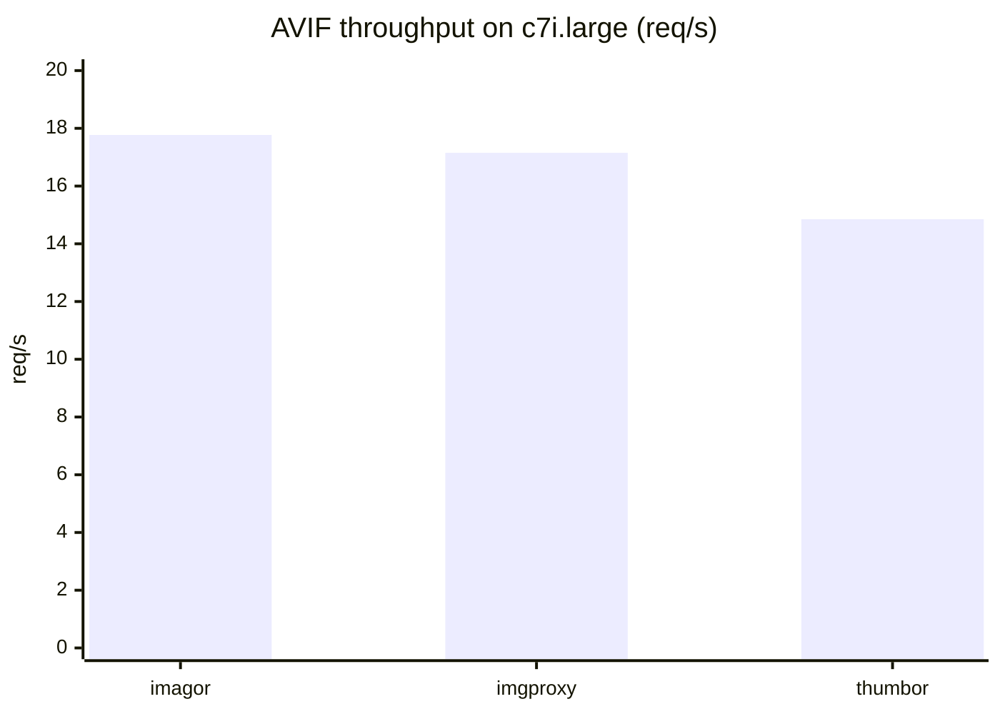

import Head from '@docusaurus/Head';

export const faqSchema = {
  '@context': 'https://schema.org',
  '@type': 'FAQPage',
  mainEntity: [
    {
      '@type': 'Question',
      name: 'Is imagor faster than thumbor?',
      acceptedAnswer: {
        '@type': 'Answer',
        text: 'On this benchmark set, imagor was faster than thumbor across JPEG, PNG, WebP, and AVIF workloads on AWS c7i.large.',
      },
    },
    {
      '@type': 'Question',
      name: 'Is imagor faster than imgproxy?',
      acceptedAnswer: {
        '@type': 'Answer',
        text: 'It depends on format and encoder settings. In this benchmark run, imagor led on PNG and AVIF, while imgproxy led on JPEG and WebP.',
      },
    },
    {
      '@type': 'Question',
      name: 'What makes imagor fast?',
      acceptedAnswer: {
        '@type': 'Answer',
        text: 'imagor combines libvips, the vipsgen Go binding, and an efficient streamed request path that reduces avoidable buffering and source-handling overhead.',
      },
    },
    {
      '@type': 'Question',
      name: 'How were the imagor benchmarks run?',
      acceptedAnswer: {
        '@type': 'Answer',
        text: 'The benchmark run used AWS EC2 c7i.large with 2 virtual users, a 5 minute test duration, a 10 second warmup, and a 512x512 resize workload. Raw result summaries are linked from the public benchmark repository.',
      },
    },
    {
      '@type': 'Question',
      name: 'Are the benchmark results reproducible?',
      acceptedAnswer: {
        '@type': 'Answer',
        text: 'Yes. The benchmark harness and committed summaries are public, and the page links to the benchmark project and rerun result artifacts used for this summary.',
      },
    },
  ],
};

export const articleSchema = {
  '@context': 'https://schema.org',
  '@type': 'TechArticle',
  headline: 'imagor benchmarks: performance vs imgproxy and thumbor',
  description:
    'imagor benchmark results comparing imagor vs imgproxy and thumbor, including throughput by format, methodology, and why imagor is one of the fastest libvips-based image processing servers.',
  author: {
    '@type': 'Organization',
    name: 'imagor',
  },
  publisher: {
    '@type': 'Organization',
    name: 'imagor',
  },
  mainEntityOfPage: 'https://docs.imagor.net/benchmarks',
  about: ['imagor', 'libvips', 'imgproxy', 'thumbor', 'image processing benchmarks'],
};

<Head>
  <title>imagor benchmarks: performance vs imgproxy and thumbor | imagor docs</title>
  <meta
    name="keywords"
    content="imagor benchmarks, imagor vs imgproxy, imagor vs thumbor, libvips benchmark, image processing server benchmark"
  />
  <meta
    property="og:title"
    content="imagor benchmarks: performance vs imgproxy and thumbor"
  />
  <meta
    name="twitter:title"
    content="imagor benchmarks: performance vs imgproxy and thumbor"
  />
  
  
</Head>

# Benchmarks

imagor is one of the fastest image processing servers available today.

That comes from the combination of [libvips](https://github.com/libvips/libvips), the Go binding [vipsgen](https://github.com/cshum/vipsgen), and imagor's streamed processing path. imagor keeps the request path close to libvips, avoids unnecessary buffering and copies for common streamed inputs, and exposes a libvips-friendly source path that works well for resize and thumbnail workloads.

## Benchmark summary

:::info Result source
Last updated: May 2026.

This summary is based on recent reruns from the public [image-servers-benchmark](https://github.com/cshum/image-servers-benchmark) project. The committed summaries for this rerun are available in the [benchmark results](https://github.com/cshum/image-servers-benchmark/tree/master/results).
:::

On this benchmark set, imagor 1.9.1 is consistently faster than thumbor overall and competitive with imgproxy.

## Why imagor is fast

imagor uses libvips for image processing and [vipsgen](https://github.com/cshum/vipsgen) for low-level libvips integration from Go. vipsgen provides generated, type-safe libvips bindings with streaming support, which helps keep the integration robust while staying close to libvips. For streamed sources, imagor keeps the data path efficient before the image even reaches the processing stage.

In practice, the main speed advantages come from a few places:

- imagor prepares streamed inputs in a way that libvips can consume efficiently
- blob reuse reduces avoidable reader churn after content sniffing and source preparation
- fanout and shared-reader handling reduce duplicated work around streamed sources
- the seekable libvips source path lets libvips load and process common inputs more efficiently
- libvips itself is highly optimized for resize, thumbnail, and transcode workloads

Quick comparison:

  

**JPEG**

  

  

**PNG**

  

  

**WebP**

  

  

**AVIF**

  

Benchmark shape:

- AWS EC2 `c7i.large`
- `2 VUs`, `5m`, `10s` warmup
- resize to `512x512`
- public `image-servers-benchmark` project with the rerun configuration documented in the linked benchmark summaries
- compared runtimes:
  - imagor: `ghcr.io/cshum/imagor:1.9.1`
  - imgproxy: benchmark harness used `darthsim/imgproxy:latest`, corresponding to imgproxy `v4.0.3`
  - thumbor: local `benchmark-thumbor:latest`, resolved from `thumbor/Dockerfile` to `thumbor 7.7.7`

Representative throughput from the committed summaries:

| Format | imagor | imgproxy | thumbor |
| --- | ---: | ---: | ---: |
| JPEG | 74.35 req/s | 82.01 req/s | 59.45 req/s |
| PNG | 18.56 req/s | 17.35 req/s | 10.23 req/s |
| WebP | 21.23 req/s | 24.27 req/s | 15.80 req/s |
| AVIF | 17.77 req/s | 17.15 req/s | 14.85 req/s |

The exact ranking still depends on image format, output settings, source shape, and deployment environment. The measured result from the current benchmark set is that imagor is one of the fastest image processing servers, clearly ahead of thumbor overall and competitive with imgproxy across common formats.

## Notes

- imagor and imgproxy are both libvips-based, so the gap is often determined by request-path overhead, source handling, and encoder settings rather than by the core image library alone
- thumbor remains a strong compatibility reference, but its Pillow-based pipeline is generally slower on this workload
- for AVIF, encoder settings matter a lot; benchmark conclusions should always be read together with the exact runtime configuration

## FAQ

### Is imagor faster than thumbor?

Yes on this benchmark set. imagor outperformed thumbor on JPEG, PNG, WebP, and AVIF on AWS `c7i.large`.

### Is imagor faster than imgproxy?

Not in every case. In this run, imagor led on PNG and AVIF, while imgproxy led on JPEG and WebP. The result depends heavily on encoder defaults, quality settings, and the image mix.

### What makes imagor fast?

imagor combines libvips, generated vipsgen bindings, and a streamed request path designed to reduce unnecessary copies and source-handling overhead before decode and transform.

### How were these benchmarks run?

The rerun used AWS EC2 `c7i.large`, `2 VUs`, `5m`, `10s` warmup, and a `512x512` resize workload. The benchmark harness and committed summaries are linked from the public repository so the setup can be reviewed and rerun.

### Are the results reproducible?

Yes. The page links to the public harness and the committed result summaries used for this write-up, so readers can inspect versions, workload shape, and output settings.
